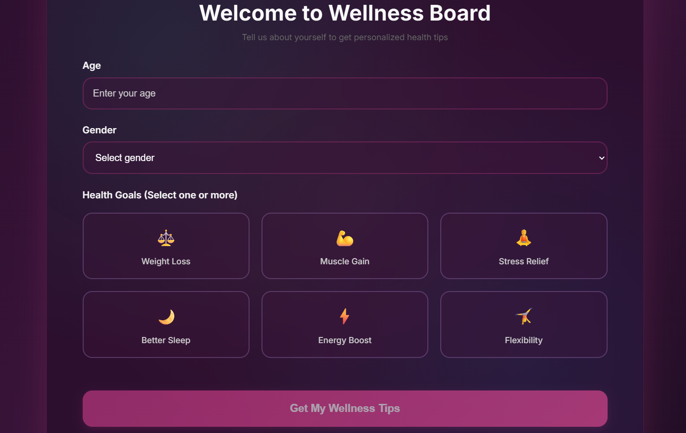
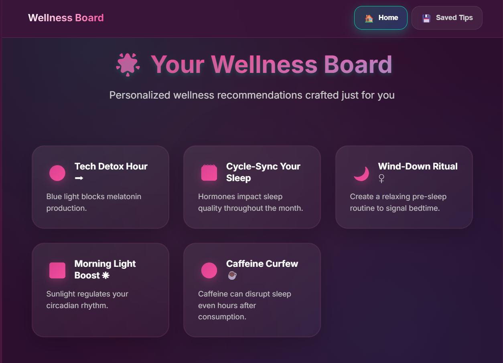
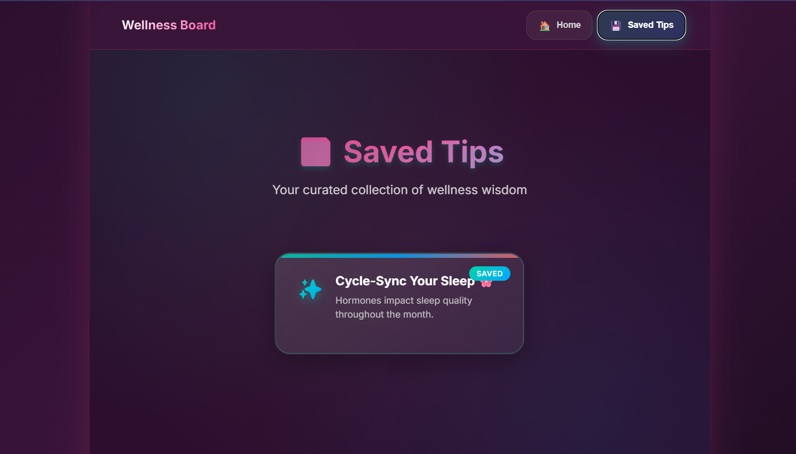
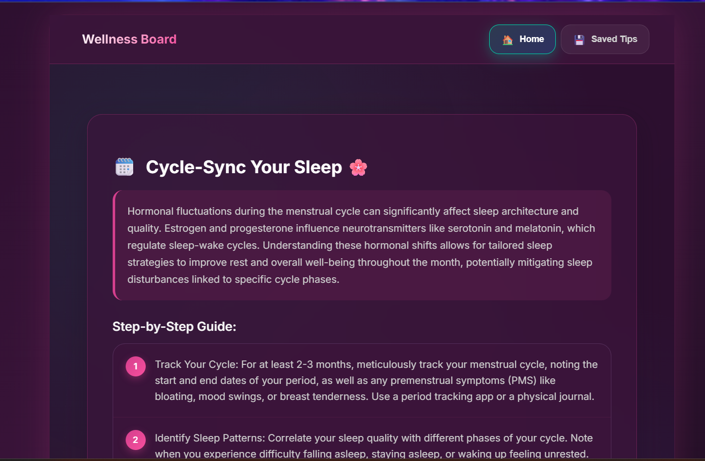

# 🌿 AI-Generated Wellness Recommendation Board  

A personalized wellness application that provides AI-generated health tips based on user profiles.  


## 1. Project Setup & Demo  

### Prerequisites  
1. Get a Gemini API key from [Google AI Studio](https://makersuite.google.com/app/apikey)  
2. Copy `.env.example` to `.env` and add your API key:  
```bash
cp .env.example .env
# Edit .env and add your REACT_APP_GEMINI_API_KEY
````

### Web Setup

```bash
npm install && npm start
```

The application will launch at `http://localhost:3000`

### Demo

The app provides a complete wellness recommendation experience with personalized AI-generated tips powered by Google's Gemini API.

---

## 2. Problem Understanding

**Goal**: Create a multi-screen wellness app that captures user profiles and generates personalized health recommendations.

**Key Requirements**:

* Profile capture (age, gender, goal selection)
* AI generates 5 personalized tips displayed as scrollable cards
* Detailed view with step-by-step advice when tapping cards
* Save favorite tips with local persistence

**Assumptions**:

* Google Gemini API for real AI-generated content
* Fallback to mock data if API is unavailable
* Local storage for persistence
* Mobile-first responsive design

---

## 3. AI Prompts & Iterations

### Gemini API Integration

**Initial Challenge**: Creating contextual, personalized wellness tips
**Solution**: Structured prompts with user profile integration

**Prompt Engineering Strategy**

```typescript
private createTipsPrompt(profile: UserProfile): string {
  const goalsText = profile.goals.join(', ');
  
  return `Generate 5 personalized wellness tips for a ${profile.age}-year-old ${profile.gender} with goals: ${goalsText}.
  
  Format as JSON array with title, description, icon, category, detailedExplanation, and steps...`;
}
```

**Refined Prompts**

* **Primary Prompt**: Generates 5 personalized tips based on age, gender, and goals
* **Detail Prompt**: Expands selected tips with comprehensive explanations
* **Fallback System**: Mock data when API is unavailable
* **JSON Parsing**: Structured responses for consistent UI rendering

**AI Features Implemented**

* Real-time tip generation via Gemini API
* Profile-based personalization
* Dynamic detailed explanations
* Error handling with graceful fallbacks

---

## 4. Architecture & Code Structure

### Core Components

* `App.tsx` - Main application with navigation logic
* `AppContext.tsx` - React Context for state management
* `ProfileScreen.tsx` - User profile capture
* `TipsScreen.tsx` - Display generated wellness tips
* `TipDetailScreen.tsx` - Detailed tip view with save functionality
* `aiService.ts` - Mock AI service for tip generation

### State Management

* React Context handles global state
* Local storage persistence for saved tips
* Profile-based tip generation and filtering

---

5. User Flow (with Screenshots)
<table> <tr> <td align="center"><b>Profile Setup</b><br></td> <td align="center"><b>Wellness Board</b><br></td> </tr> <tr> <td align="center"><b>Saved Tips</b><br></td> <td align="center"><b>Detailed Tip</b><br></td> </tr> </table>
---

## 6. Key Features Implemented

### Profile Capture

* Age validation (13-120)
* Gender selection with inclusive options
* Multi-select health goals with visual feedback

### AI Tip Generation

* Profile-based filtering
* Loading states with spinner
* Regenerate functionality for fresh recommendations

### Tip Display

* Card-based interface with icons
* Smooth animations and hover effects
* Visual indicators for saved tips

### Detailed Tips

* Comprehensive explanations
* Step-by-step actionable advice
* Save/unsave functionality

---

## 7. Technology Stack

* **Frontend**: React 18 with TypeScript
* **Styling**: CSS3 with modern features (Grid, Flexbox, Animations)
* **Icons**: Lucide React for consistent iconography
* **State**: React Context API
* **Storage**: Browser localStorage

---

### Known Issues / Improvements  

#### Current Limitations  
- Requires Gemini API key (free tier has usage limits)  
- Network dependency for AI features  
- Basic error handling for API failures  

#### Future Enhancements  
- Multi-language support for global users  
- User accounts and cloud synchronization  
- Progress tracking and habit formation  
- Integration with fitness wearables  
- Social sharing features  
- Push notifications for reminders  
- Offline caching for previously generated tips  
- Advanced personalization with user feedback  

---

## 9. Bonus Features Added

### User Experience

* **Smooth Animations**: CSS transitions for all interactions
* **Loading States**: Realistic AI generation simulation
* **Visual Feedback**: Hover effects and selection states
* **Responsive Design**: Mobile-first approach

### Technical Enhancements

* **TypeScript**: Full type safety throughout
* **Local Persistence**: Automatic save/restore of favorites
* **Error Boundaries**: Graceful error handling
* **Performance**: Optimized re-renders with React best practices

---

## Running the Application

1. Ensure Node.js is installed
2. Navigate to the project directory
3. Run `npm install` to install dependencies
4. Run `npm start` to launch the development server
5. Open `http://localhost:3000` in your browser

---

 The application provides a complete wellness recommendation experience with personalized, AI-generated tips tailored to individual user profiles and goals.

```